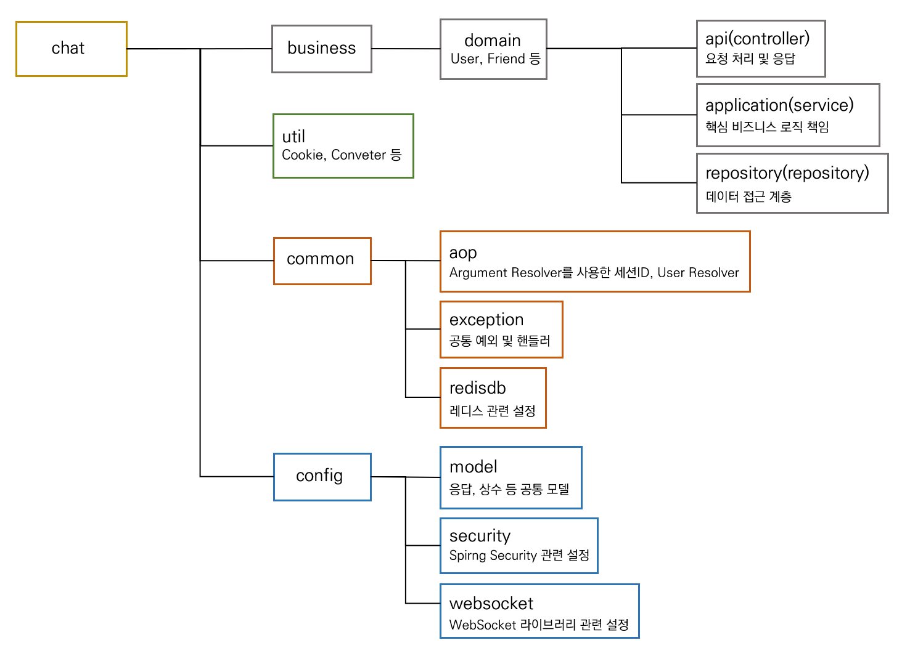

# web-socket-chat

## 프로젝트 정보

> 개발기간: 2022.03 ~ 2022.08  
> 기술스택: Java, SpringBoot

## 프로젝트 소개

WebSocket 라이브러리를 사용한 채팅 서비스   
### 프로젝트 목적
- Redis, Mysql 등 다양한 스택 경험 및 SpringBoot 전반적 이해를 위함
- WebSocket Protocol 기반의 채팅서버 구축을 통한 Http 통신 이해
- Layer Architecture 형태의 프로젝트 구조 경험
- AOP, DI 개념 학습

### 구현하고자 했던 기능
- Session 기반의 로그인 구현
- WebSocket 기반의 채팅 기능 구현
- 친구 추가 및 관리 기능

### 디렉토리 구조  

## 회고  
- [내용](https://dlrtn.notion.site/web-socket-chat-ac6a3cdd0c7547389e2196fe6695fb37)

